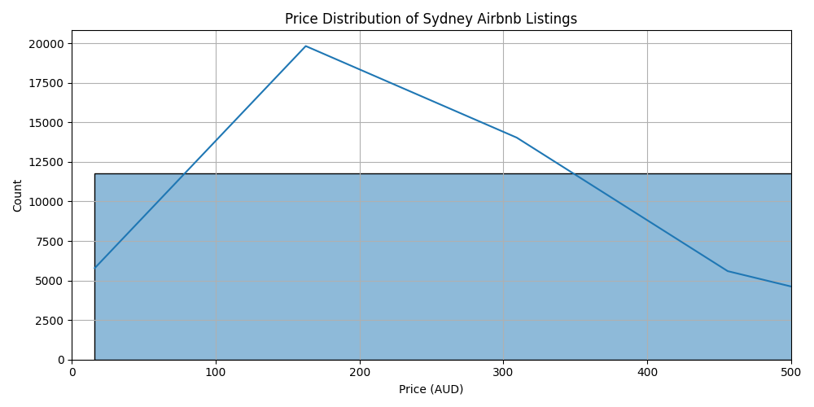
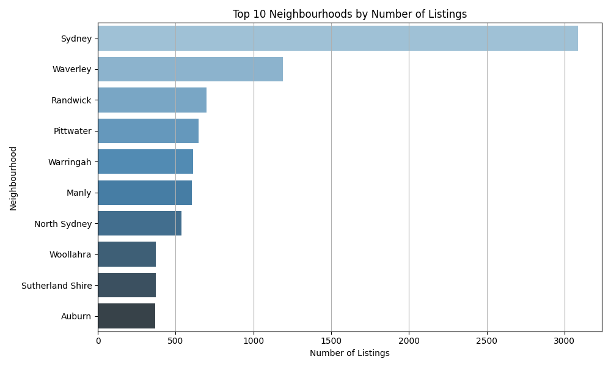
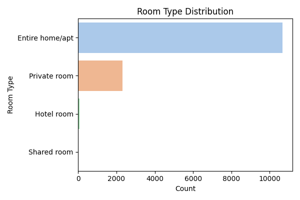

# 🏠 Airbnb Exploratory Data Analysis – Sydney

This project performs an exploratory data analysis (EDA) on Airbnb listings in Sydney using Python. The dataset comes from the public [Inside Airbnb](http://insideairbnb.com/get-the-data.html) source.

---

## 📌 Project Objectives
- Explore Airbnb listing data to understand trends and patterns.
- Visualize pricing distribution, availability, and neighbourhood popularity.
- Draw insights from host behavior and listing characteristics.

---

## 🛠️ Tools & Technologies
- Python (Pandas, Numpy)
- Data Visualization (Matplotlib, Seaborn)
- Jupyter Notebook (via VS Code)
- Dataset: `listings.csv` from Inside Airbnb

---

## 📁 Project Structure

```
airbnb_eda/
├── Airbnb_EDA.ipynb          # Main notebook with code and visualizations
├── requirements.txt          # Python dependencies
├── README.md                 # Project overview
├── data/
│   └── listings.csv          # Raw dataset
└── img/
    ├── price_distribution.png
    ├── top_neighbourhoods.png
    └── room_type_distribution.png
```

---

## 📷 Sample Visualizations

### 💰 Price Distribution


### 🏘️ Top Neighbourhoods by Listings


### 🛏️ Room Type Distribution


---

## 🧠 Key Insights

- 💰 **Price Distribution**: Most listings fall under $200 AUD per night, with a steep drop-off after $300. Outliers above $500 exist but are rare.
- 🏘️ **Neighbourhood Trends**: The highest concentration of listings is in central areas like Sydney and Waverley, followed by Randwick and coastal suburbs like Manly.
- 🛏️ **Room Types**: Overwhelming majority are "Entire home/apt" listings, followed by "Private rooms". "Shared" and "Hotel room" types are nearly insignificant.

---

## 📎 Dataset Source
[Inside Airbnb – Get the Data](http://insideairbnb.com/get-the-data.html)

---

## 🧑‍💻 Author
Agustín Jaureguiberry  
[GitHub](https://github.com/agusij) | [LinkedIn](https://www.linkedin.com/in/aijaureguiberry)

---
